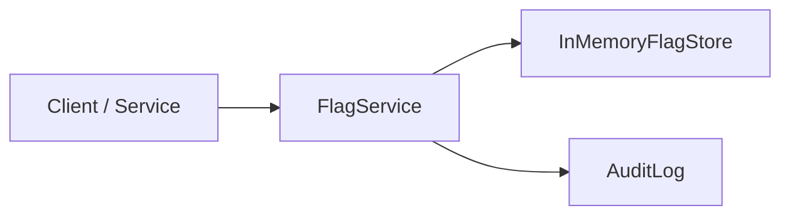

# @aadiaiagent/platform-control-plane

**Principal / Staff SWE showcase** — a zero-runtime-dependency TypeScript library for multi-tenant feature flags, kill switches, percentage rollouts, and an append-only audit log.

Designed as a **platform control plane**: tenants configure flags independently; evaluation is deterministic; every mutation is auditable.

## Architecture



| Component | Role |
|-----------|------|
| `FlagService` | Mutations + evaluation with kill-switch / rollout / default precedence |
| `InMemoryFlagStore` | Tenant-scoped flag definitions |
| `AuditLog` | Append-only event history |
| `stablePercent` | Deterministic FNV-1a hash → bucket `0..99` |

## Quickstart

```bash
npm install
npm run typecheck
npm test
npm run example
```

```ts
import {
  AuditLog,
  FlagService,
  InMemoryFlagStore,
} from "@aadiaiagent/platform-control-plane";

const store = new InMemoryFlagStore();
const audit = new AuditLog();
const flags = new FlagService(store, audit);

flags.setFlag("acme", {
  key: "checkout-v2",
  defaultEnabled: false,
  rolloutPercent: 10,
});

const enabled = flags.evaluate("checkout-v2", {
  tenantId: "acme",
  userId: "user-42",
});
```

**Requirements:** Node 20+, ESM. No API keys. Runtime deps: none (dev: TypeScript, Vitest, tsx).

## Design

### Evaluation precedence

```
kill switch  >  rollout percent  >  defaultEnabled
```

1. **Kill switch** — if `killSwitch === true`, always `false` (incident response).
2. **Rollout** — if `rolloutPercent` is set, user is in cohort when `stablePercent(tenantId:userId:key) < rolloutPercent`.
3. **Default** — otherwise return `defaultEnabled`.

### Deterministic hashing

`stablePercent(seed)` uses FNV-1a over the UTF-16 code units of `seed`, mapped to `[0, 99]`. The same `(tenantId, userId, key)` always lands in the same bucket — sticky rollouts without sticky storage.

### Audit

Every `setFlag`, `enableKillSwitch`, `setRollout`, and `evaluate` appends an `AuditEvent`. The log never mutates or deletes prior entries; `list()` returns a defensive copy.

## Layout

```
src/
  types.ts                 TenantId, FlagDefinition, EvalContext, AuditEvent
  hash.ts                  stablePercent
  store/InMemoryFlagStore.ts
  audit/AuditLog.ts
  flags/FlagService.ts
  index.ts                 public exports
tests/FlagService.test.ts
examples/basic.ts
```

## Roadmap

- **Remote store** — Redis / Postgres-backed `FlagStore` with the same interface
- **RBAC** — actor identity on mutations; policy gates before write
- Signed config snapshots & webhook fan-out for edge caches

## License

MIT © 2026 aadiaiagent-max
